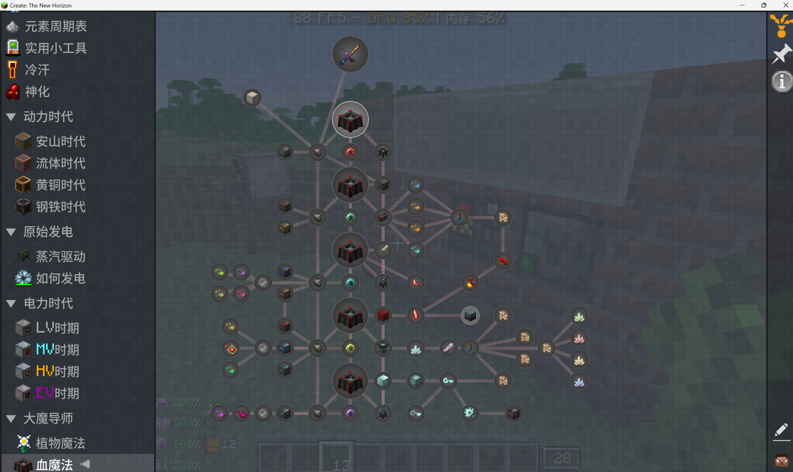
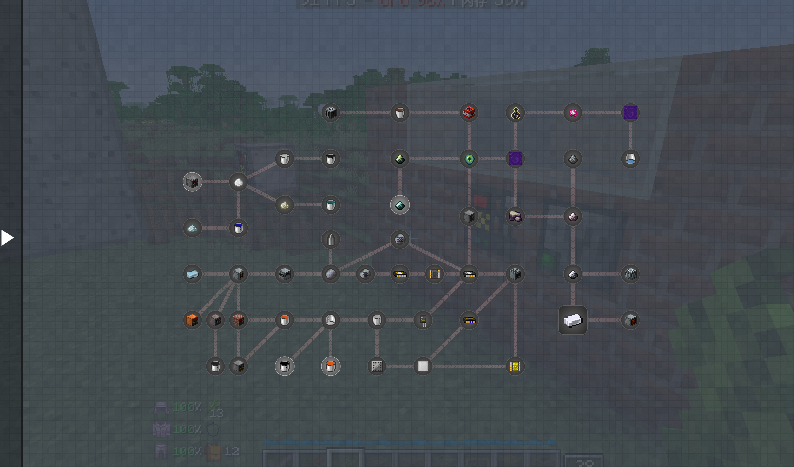
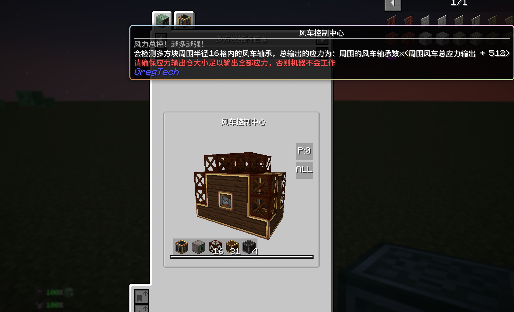

  

[)](https://www.mcmod.cn/modpack/897.html)

)

    <a href="https://www.bilibili.com/video/BV179XyYFE56">观看宣传视频</a> ·
    <a href="https://github.com/CTNH-Team/Create-New-Horizon/issues">提交 Bug 以及请求新特性</a> ·
    <a href="https://kdocs.cn/l/cvdYmhg2ome0">整合包反馈文档</a>

**Welcome!**

CTNH is a modpack which combined Create and GregTech together! According to the core mod Gregtech, we adjust lots of mods with KubeJS and write some new mods!

## Development

- All core mods are outside this repository, see [CTNH-Team/CTNH-Modules](https://github.com/CTNH-Team/CTNH-Modules) for more details.
- See [DEVELOPMENT.md](DEVELOPMENT.md) for instructions on modpack packing.

## License

All code is licensed under the [GNU LGPL v3 License](https://www.gnu.org/licenses/lgpl-3.0.en.html).

All artwork (images, textures, models, animations, etc.) is licensed under the [Creative Commons Attribution-NonCommercial 4.0 International License](http://creativecommons.org/licenses/by-nc/4.0/), unless stated otherwise.

---

## 总体介绍

集科技、魔法、冒险于一体的大型魔改整合包！名字源自大名鼎鼎的 GTNH，此整合包的理想也是做出一个能够在玩法趣味上不断追赶 GTNH 的整合包。

本整合包以**格雷科技**和**机械动力**为核心，辅以数个精选优质的魔法和冒险模组，将玩家的体验拉到最大，得以让你在高版本 1.20.1 中感受到来自远古古神 GregTech 和新晋王者 Create 带给你的魅力。

### 核心模组
#### 科技

- [格雷科技](https://www.curseforge.com/minecraft/mc-mods/gregtechceu-modern)及其附属
- [机械动力](https://www.curseforge.com/minecraft/mc-mods/create)及其附属
- [EnderIO](https://www.curseforge.com/minecraft/mc-mods/ender-io)

#### 魔法

- [植物魔法](https://www.curseforge.com/minecraft/mc-mods/botania)及其附属
- [血魔法](https://www.curseforge.com/minecraft/mc-mods/blood-magic)
- [新生魔艺](https://www.curseforge.com/minecraft/mc-mods/blood-magic)及其附属

#### 冒险

- [暮色森林](https://www.curseforge.com/minecraft/mc-mods/the-twilight-forest)
- [天境](https://www.curseforge.com/minecraft/mc-mods/aether)
- [Ad: Astra](https://www.curseforge.com/minecraft/mc-mods/ad-astra)
- [Alex 洞穴](https://www.curseforge.com/minecraft/mc-mods/alexs-caves)
- [传说生存](https://www.curseforge.com/minecraft/mc-mods/legendary-survival-overhaul)

#### Qol

- [脚步声](https://www.curseforge.com/minecraft/mc-mods/presence-footsteps-forge)
- [动态环绕](https://www.curseforge.com/minecraft/mc-mods/dynamic-surroundings)
- [Weather2](https://www.curseforge.com/minecraft/mc-mods/weather-storms-tornadoes)

### 主线科技

整合包以和机械动力（前期）和格雷科技（中后期）为中心玩法不断扩展，目前已实现从世界出生到格雷 UHV 电压阶段的主线内容（未来会根据需求调整）。本包修改并添加了 10000+ 魔改配方，重置了原版 GT 的多种矿物产线，自定义了**一百多个**拥有独特机制的格雷多方块（如符合逻辑斯蒂生长曲线的发酵罐、随天气时间效率发生变化的光伏发电，以剥削村民来生产的“血汗工厂”特色机器等），未来计划根据需要将添加更多的巨构多方块机器，并同时不断优化玩家游玩的体验。

此外，我们制作组在 GTM 本体抛弃与机械动力的联动后将这一部分联动功能分离出来，并加以改进创新，自研出 [CT++](https://www.curseforge.com/minecraft/mc-mods/ct) 模组，实现了基础应力机器以及应力多方块的模板，在未来更会增加许多与 GregTech 深入联动的机制和配方。

### 魔法与冒险
除了主线本身，本整合包也积极调整各路支线与主线之间的联系，植物魔法和血魔法的相关魔改已全部完成（但仍计划继续加入特色机器），玩家们可以在发展魔法的同时利用魔力进行发电/召唤陨石来获取所需要的资源/消耗魔力也能够提升部分机器的运行效率，不过发展魔法也离不开一些独特的科技和冒险材料。

对于不同维度的探险也是一大特点（之后会考虑加入玩家选择是否跳过探险环节的机制），冒险元素不会过分给予游戏科技主线流程负面影响，各种冒险元素组合调整成的趣味玩法也能在一定程度上帮助科技发展。有神化的加持再加上调整过的盔甲防御曲线应该不会打不过怪吧。

当然，本整合包还有许多提升生活质量的模组和改动，添加的体温模组和天气模组虽然拓展了游戏难度的维度，但经过玩家测试反馈不断调整后的各个群系温度让整合包更具现实感。此外，不同的农业相关模组和东方女仆也试图让玩家能在各种复杂数值中寻求简单的闲情雅致，当玩家辛勤劳动，取得丰收的成果之后，更是可以利用乐事系列模组做出的美味食物换取货币，从小市场中购买发展科技所需的工业原料。

### 魔改内容

1. **深度魔改的材料配方** - 对主要核心模组几乎所有的物品配方进行了重构，整合包添加了 10000+ 配方，移除了 2000+ 配方，修改了 4000+ 配方
2. **自定义的多方块机器** - 利用 GregTech 的 API，定义了 100+ 多方块结构，其中至少一半有着独特的配方机制。
3. **完善的毕业流程** - 虽然整合包还在持续更新开发中，但目前已经拥有了一个阶段性的完整目标，位于格雷科技 UHV 电压末期，目前毕业所需时间大概 250+h
4. **详尽的任务指导** - 拥有 800+ 任务指导，以及丰富的任务奖励（食物），帮助你度过前期，以及从原始人阶段到 UHV 毕业过程中的详细教程
5. **核心模组** - 为了满足魔改需求，我们制作了自己的核心模组 CTNH-Core
6. **对多个模组的优化和修复** - 鉴于有部分模组存在 bug 以及卡顿的现象，我们自己通过 mixin 或者 hotai 对 bug 进行了修复，以提高玩家们的体验
7. **自定义结构** - 制作组藏了一些有趣的结构彩蛋在世界中，期待你来发掘

---

## 上手指南
### 配置需求

- **最低内存：***5G*****
- **推荐内存：***6G-8G*****  

本整合包将会持续对游戏进行优化，以给玩家提供一个良好的体验。

## 未来计划

本整合包将会不断更新，给大家提供更多新奇有趣的新流程，新机器，新世界。

* **生物线拓展**：引入血肉重铸模组，深入魔改，打造全新的生物机器！
* **量子反常**：为整合包后期流程加入量子力学！
* **新能源新概念**：磁场和磁力将会加入游戏，与格雷机器之间产生复杂的反应
* **更多更好的机械动力**：会持续拓宽机械动力的上限，推出更多带有格雷特色的机械动力机器
* **魔法时代**：将魔法与科技更进一步地融合起来

---

## 游戏内截图展示

带有机械动力特色的格雷机器

---

## 开发组成员

**整合包仓库贡献者（排名不分先后）**

**核心模组 CTNH-Core 贡献者（排名不分先后）**

## 特别鸣谢
> _感谢每一位制作组成员一直以来的辛勤付出，同时感谢所有支持我们整合包的玩家，更要感谢所有游玩并对我们提出许多建设性意见的广大mc玩家们！_